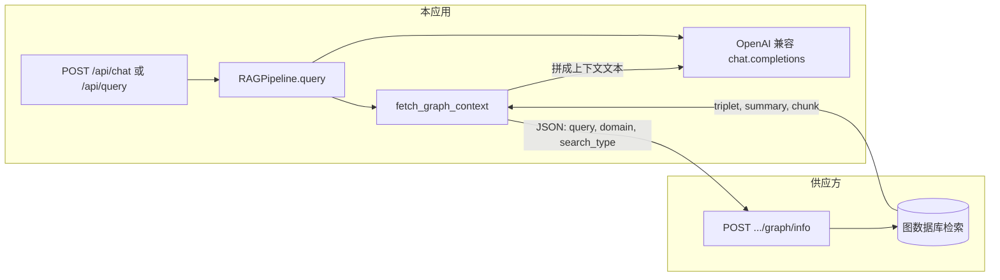
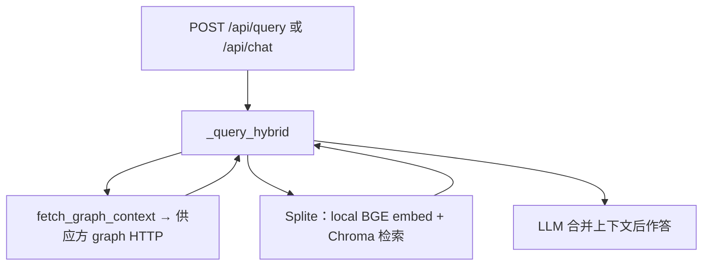

# 外部图数据库 RAG 实现说明

本文档总结供应方图数据库与本地 RAG 的对接方式。主要包含：

- **`RAG_BACKEND=external_graph`**：仅用图 HTTP 检索 + 本地 LLM 作答（不跑默认 Chroma 向量检索）。
- **`RAG_BACKEND=hybrid`（`system2` 起）**：**并行**图 HTTP + **Splite 专用** BGE Chroma 集合，合并上下文后再由 LLM 作答；详见文末 **§14** 与总方案 [`doc/方案-双路检索-BGE本地向量与远端图库.md`](方案-双路检索-BGE本地向量与远端图库.md)。

---

## 1. 架构与数据流



- **图存储与检索逻辑**：在供应方；本仓库只发约定 JSON，并解析约定字段。
- **生成回答**：仍在本地，依赖 `VOLCENGINE_API_KEY`、`LLM_MODEL`（与原先 Chroma 方案相同）。

---

## 2. 涉及文件

| 文件 | 作用 |
|------|------|
| `backend/config.py` | `RAG_BACKEND`（含 `hybrid`）、图接口、`HYBRID_*` Splite 集合与上下文上限等 |
| `backend/core/external_graph.py` | HTTP 请求、解析 `message`、三元组字典格式化、拼上下文与 sources |
| `backend/core/rag.py` | `query()` 分支；`_query_external_graph`；`_query_hybrid`；图/混合上下文与 LLM |
| `backend/main.py` | `external_graph` 跳过默认嵌入预热；`hybrid` 预热 Splite BGE |
| `backend/api/query.py` | `external_search`、`splite_search`（仅 Splite 向量、无 LLM）、`answer_mode` 含 `hybrid_graph_vector` |
| `backend/tests/core/test_external_graph.py` | 图客户端单元测试 |
| `backend/tests/core/test_rag_hybrid.py` | 混合 RAG 单元测试 |
| `CLAUDE.md` | 约定使用 `backend/venv` 安装依赖与跑 pytest |

---

## 3. 环境变量（`backend/.env` 示例）

以下仅为说明，**不要**把真实 API Key 提交到 git。

```env
# 启用供应方图检索 + 本地大模型作答
RAG_BACKEND=external_graph

# 可选；不设则用 config.py 中的默认值
EXTERNAL_GRAPH_API_URL=http://14.103.133.160:8022/graph/info
EXTERNAL_GRAPH_DOMAIN=南兴装备
EXTERNAL_GRAPH_SEARCH_TYPE=triplet
EXTERNAL_GRAPH_TIMEOUT=60

# 仍必需：用于生成最终回答
VOLCENGINE_API_KEY=你的密钥
LLM_MODEL=你的接入点或模型名
```

修改 `.env` 后请在 **`backend/venv`** 环境中重启 `uvicorn`。

---

## 4. 供应方 HTTP 约定

**请求**：`POST`，`Content-Type: application/json`，body 形如：

```json
{
  "query": "用户当前问题文本",
  "domain": "南兴装备",
  "search_type": "triplet"
}
```

**响应**（已对接的一种形态）：顶层含 `success`；`message` 可为对象或 JSON 字符串，其中常见字段：

- `triplet`：字符串列表，或「头/关系/尾」字典列表（见下文代码中的字段映射）
- `summary`：摘要列表
- `chunk`：文本块列表

---

## 5. 配置项代码（`backend/config.py`）

来源：[`backend/config.py`](../backend/config.py) 第 75–80 行

```python
    # RAG backend: "chromadb" = local embeddings + Chroma; "external_graph" = supplier graph HTTP + LLM.
    RAG_BACKEND: str = "chromadb"
    EXTERNAL_GRAPH_API_URL: str = "http://14.103.133.160:8022/graph/info"
    EXTERNAL_GRAPH_DOMAIN: str = "南兴装备"
    EXTERNAL_GRAPH_SEARCH_TYPE: str = "triplet"
    EXTERNAL_GRAPH_TIMEOUT: float = 60.0
```

### 5.1 为何 `config.py` 里 `RAG_BACKEND` 默认仍是 `chromadb`？

同一套代码要**同时支持**两种 RAG：本地 Embedding + Chroma（`chromadb`）与供应方图 HTTP（`external_graph`）。`config.py` 里的默认值表示**「未通过环境变量覆盖时的安全默认」**：

- **向后兼容**：别人拉代码、CI、未配 `.env` 的机器若默认就是 `external_graph`，启动后会立刻依赖外网/内网图服务地址，容易直接失败；默认 `chromadb` 仍可按原方式本地跑文档问答。
- **真正启用图库**：在 **`backend/.env`**（或进程环境变量）中设置 **`RAG_BACKEND=external_graph`** 即可。pydantic-settings 会**覆盖**源码中的默认值，运行时 `settings.RAG_BACKEND` 即为图模式，**不必**为了用图而改 `config.py` 里的那一行。
- **分支策略**：`nanxing-db` 上也可把默认值改成 `external_graph`，但合并到 `main` 或给其他环境用时风险更大；通常保持代码默认 `chromadb`，仅在**部署图方案的环境**里用 `.env` 切换。

**一句话**：源码里写 `chromadb` 是「零配置也能跑」的默认；要用供应方图数据库，在 `.env` 里显式写 `RAG_BACKEND=external_graph`。

---

## 6. 图 HTTP 客户端与上下文拼装（`backend/core/external_graph.py`）

### 6.1 三元组：字符串或字典 → 统一成行

字典时尝试常见键名（`head`/`subject`、`relation`/`predicate`、`tail`/`object` 等），格式化为 `头 -关系-> 尾`：

来源：[`backend/core/external_graph.py`](../backend/core/external_graph.py) 第 15–42 行

```python
def _triplet_item_to_line(item: Any) -> str:
    """Turn one graph triplet (string or common dict shape) into one human-readable line."""
    if item is None:
        return ""
    if isinstance(item, str):
        return item.strip()
    if not isinstance(item, dict):
        return str(item).strip()

    head_keys = ("head", "subject", "source", "h", "entity", "start", "from")
    rel_keys = ("relation", "predicate", "rel", "type", "edge", "r")
    tail_keys = ("tail", "object", "target", "t", "end", "to", "o")

    def pick(keys: tuple[str, ...]) -> str:
        for k in keys:
            v = item.get(k)
            if v is not None and str(v).strip():
                return str(v).strip()
        return ""

    head = pick(head_keys)
    rel = pick(rel_keys)
    tail = pick(tail_keys)
    if head and rel and tail:
        return f"{head} -{rel}-> {tail}"
    if head and tail:
        return f"{head} -> {tail}"
    return json.dumps(item, ensure_ascii=False)
```

### 6.2 请求体、解析与 Markdown 小节

通过 **`import config`** 使用 **`config.settings`**，便于测试里 `patch("config.settings", ...)`。

来源：[`backend/core/external_graph.py`](../backend/core/external_graph.py) 第 81–162 行

```python
def fetch_graph_context(query: str) -> Tuple[str, List[dict], Dict[str, Any]]:
    """
    POST JSON {query, domain, search_type} to the supplier graph API.

    Expects a graph/RAG-style JSON body (e.g. ``success`` + ``message`` with
    ``triplet``, ``summary``, ``chunk``). Triplets may be strings or dicts with
    common keys (head/subject + relation/predicate + tail/object).

    Returns:
        (context_text_for_llm, sources_for_api_response, raw_body_for_debug)
    """
    cfg = config.settings
    url = (cfg.EXTERNAL_GRAPH_API_URL or "").strip()
    if not url:
        raise ValueError("EXTERNAL_GRAPH_API_URL is empty")

    payload = {
        "query": query.strip(),
        "domain": cfg.EXTERNAL_GRAPH_DOMAIN,
        "search_type": cfg.EXTERNAL_GRAPH_SEARCH_TYPE,
    }
    timeout = float(cfg.EXTERNAL_GRAPH_TIMEOUT or 60.0)

    with httpx.Client(timeout=timeout) as client:
        response = client.post(url, json=payload)
        response.raise_for_status()
        body: Dict[str, Any] = response.json()

    if not body.get("success", True):
        msg = body.get("message", "unknown error")
        raise RuntimeError(f"Graph API reported failure: {msg}")

    message = _normalize_message(body.get("message"))
    triplets = _as_str_list(message.get("triplet"))
    summaries = _as_str_list(message.get("summary"))
    chunks = _as_str_list(message.get("chunk"))

    parts: List[str] = []
    if triplets:
        lines = "\n".join(f"{i + 1}. {t}" for i, t in enumerate(triplets))
        parts.append(f"## 图数据库三元组\n{lines}")
    if summaries:
        lines = "\n".join(f"{i + 1}. {t}" for i, t in enumerate(summaries))
        parts.append(f"## 摘要\n{lines}")
    if chunks:
        lines = "\n".join(f"{i + 1}. {t}" for i, t in enumerate(chunks))
        parts.append(f"## 文本块\n{lines}")

    context = "\n\n".join(parts).strip()
    meta: Dict[str, Any] = {
        "triplet_count": len(triplets),
        "summary_count": len(summaries),
        "chunk_count": len(chunks),
    }

    sources: List[dict] = []
    for i, text in enumerate(triplets):
        sources.append({
            "chunk_id": f"graph-triplet-{i + 1}",
            "score": 1.0,
            "text": text[:500] + "..." if len(text) > 500 else text,
            "document_id": None,
            "document_title": "图数据库·三元组",
        })
    for i, text in enumerate(summaries):
        sources.append({
            "chunk_id": f"graph-summary-{i + 1}",
            "score": 1.0,
            "text": text[:500] + "..." if len(text) > 500 else text,
            "document_id": None,
            "document_title": "图数据库·摘要",
        })
    for i, text in enumerate(chunks):
        sources.append({
            "chunk_id": f"graph-chunk-{i + 1}",
            "score": 1.0,
            "text": text[:500] + "..." if len(text) > 500 else text,
            "document_id": None,
            "document_title": "图数据库·文本块",
        })

    return context, sources, {"response": body, "meta": meta}
```

### 6.3 图库无命中时的系统提示（无上下文走 LLM）

来源：[`backend/core/external_graph.py`](../backend/core/external_graph.py) 第 164–169 行

```python
def build_graph_system_prompt_no_hits() -> str:
    return (
        "你是通用助手。本轮「图数据库检索」没有返回可用的三元组、摘要或文本块；"
        "不要编造具体设备条款或内部数据。回答语言与用户问题一致。"
    )
```

---

## 7. RAG 流水线分支（`backend/core/rag.py`）

### 7.1 `query()` 入口：按 `RAG_BACKEND` 分流

来源：[`backend/core/rag.py`](../backend/core/rag.py) 第 57–60 行

```python
        try:
            backend = (getattr(settings, "RAG_BACKEND", "chromadb") or "chromadb").strip().lower()
            if backend == "external_graph":
                return self._query_external_graph(question, retrieval_query)
```

### 7.2 外部图路径：取上下文 → 校验 LLM 配置 → 生成回答

来源：[`backend/core/rag.py`](../backend/core/rag.py) 第 164–248 行

```python
    def _query_external_graph(
        self,
        question: str,
        retrieval_query: Optional[str],
    ) -> dict:
        """Retrieve context from supplier graph HTTP API, then answer with the LLM."""
        from core.external_graph import (
            build_graph_system_prompt_no_hits,
            fetch_graph_context,
        )

        q = (retrieval_query or question).strip() or question.strip()
        try:
            context, sources, _ = fetch_graph_context(q)
        except Exception as e:
            return {
                "answer": f"图数据库请求失败：{str(e)}",
                "sources": [],
                "confidence": 0.0,
                "context_used": 0,
                "error": str(e),
                "answer_mode": "system",
            }

        if not context.strip():
            if (
                settings.VOLCENGINE_API_KEY
                and str(settings.VOLCENGINE_API_KEY).strip()
                and str(self.model).strip()
            ):
                answer = self._generate_answer_without_context(
                    question,
                    system_prompt=build_graph_system_prompt_no_hits(),
                )
                return {
                    "answer": answer,
                    "sources": [],
                    "confidence": 0.0,
                    "context_used": 0,
                    "answer_mode": "llm_direct",
                }
            return {
                "answer": (
                    "图数据库未返回三元组或摘要；未配置大模型时无法生成补充回答。"
                    "请在 backend/.env 中设置 VOLCENGINE_API_KEY 与 LLM_MODEL 后重启。"
                ),
                "sources": [],
                "confidence": 0.0,
                "context_used": 0,
                "answer_mode": "system",
            }

        if not settings.VOLCENGINE_API_KEY or not str(settings.VOLCENGINE_API_KEY).strip():
            return {
                "answer": (
                    "已从图数据库取回上下文，但未配置 VOLCENGINE_API_KEY，无法调用大模型。"
                    "请在 backend/.env 中设置后重启服务。"
                ),
                "sources": sources,
                "confidence": 1.0,
                "context_used": len(sources),
                "answer_mode": "system",
            }

        if not str(self.model).strip():
            return {
                "answer": (
                    "已从图数据库取回上下文，但未配置 LLM_MODEL。"
                    "请在 backend/.env 中设置接入点或模型名后重启。"
                ),
                "sources": sources,
                "confidence": 1.0,
                "context_used": len(sources),
                "answer_mode": "system",
            }

        answer = self._generate_answer_graph(question, context)

        return {
            "answer": answer,
            "sources": sources,
            "confidence": 1.0,
            "context_used": len(sources),
            "answer_mode": "external_graph",
        }
```

### 7.3 图上下文专用对话模板

来源：[`backend/core/rag.py`](../backend/core/rag.py) 第 250–274 行

```python
    def _generate_answer_graph(self, question: str, context: str) -> str:
        """LLM answer when context comes from the external knowledge graph."""
        messages = [
            {
                "role": "system",
                "content": (
                    "你是技术支持助手。请仅根据用户消息中提供的「图数据库检索结果」作答；"
                    "其中可能包含三元组（实体-关系-实体）、摘要与文本块。"
                    "若这些信息不足以回答，须明确说明信息不足，不要编造未出现的事实。"
                    "引用时可概括性说明来自图数据库检索结果。"
                    "回答语言必须与用户问题一致。"
                ),
            },
            {
                "role": "user",
                "content": f"图数据库检索结果:\n{context}\n\nQuestion: {question}\n\nAnswer:",
            },
        ]
        response = self.client.chat.completions.create(
            model=self.model,
            messages=messages,
            max_tokens=self.max_tokens,
            temperature=self.temperature,
        )
        return response.choices[0].message.content
```

---

## 8. 启动时跳过本地 Embedding 预热（`backend/main.py`）

在 `RAG_BACKEND=external_graph` 时不再调用 `EmbeddingGenerator().embed_text("warmup")`，避免无嵌入配置时的无意义启动开销：

来源：[`backend/main.py`](../backend/main.py) 第 34–60 行

```python
    # Warm up embedding so first chat/upload does not appear to "hang" with no server log.
    try:
        rag_backend = (getattr(settings, "RAG_BACKEND", "chromadb") or "chromadb").strip().lower()
        if rag_backend == "external_graph":
            print("RAG_BACKEND=external_graph: skipping local embedding warmup.")
        else:
            from storage.vector_store import EmbeddingGenerator

            backend = (settings.EMBEDDING_BACKEND or "volcengine").strip().lower()
            if backend == "local":
                if settings.TRANSFORMERS_OFFLINE:
                    print(
                        "Loading local embedding model（离线模式：从本地缓存加载，不访问 Hugging Face Hub）..."
                    )
                else:
                    print(
                        "Loading local embedding model (first run may download from Hugging Face; can take several minutes)..."
                    )
            else:
                mm = bool(getattr(settings, "EMBEDDING_USE_MULTIMODAL_API", False))
                api_note = ", multimodal /embeddings/multimodal" if mm else ""
                print(
                    f"Warming up Ark embeddings (backend={settings.EMBEDDING_BACKEND}, "
                    f"model={settings.EMBEDDING_MODEL or 'unset'}{api_note})..."
                )
            EmbeddingGenerator().embed_text("warmup")
            print("Embedding backend ready.")
```

---

## 9. Chat 与图检索 query 的对应关系（`backend/api/query.py`）

多轮对话时，**整段历史 + 当前问句** 仍传给大模型作为 `question`；**仅当前用户一句** 作为 `retrieval_query` 发给图接口（与原先向量检索「只 embed 最新一句」一致）：

来源：[`backend/api/query.py`](../backend/api/query.py) 第 215–224 行

```python
        # Combine history with current question
        full_question = f"{history_context}\nCurrent question: {request.message}"

        result = get_rag_pipeline().query(
            question=full_question,
            document_ids=request.document_ids,
            top_k=request.top_k,
            # Embed only the latest user turn; long history wrecks semantic search.
            retrieval_query=request.message.strip(),
        )
```

---

## 10. 未改动的行为说明

- **`RAG_BACKEND` 默认 `chromadb`**：未改 `.env` 时行为与改造前一致（本地 Embedding + 默认 `CHROMADB_COLLECTION`）。
- **`POST /api/search`**：仍为**默认集合**的向量语义检索，不调用图接口。
- **`POST /api/splite_search`**：仅检索 **Splite BGE** 集合（`HYBRID_SPLITE_*`），不调用 LLM，便于 Swagger 单独调试混合模式中的本地一路。
- **文档上传与索引**：仍写入本地存储与默认向量库；图 / hybrid 问答可额外依赖 Splite 灌库集合，应用启动仍会初始化 `DocumentStore` / 默认 `VectorStore`。

---

## 11. 测试

在 **`backend/venv`** 中执行（若尚未安装 pytest，需 `pip install pytest`；若 `pytest.ini` 带 `--cov` 但未装 `pytest-cov`，可加 `-o addopts=`）：

```bash
cd backend
.\venv\Scripts\Activate.ps1
python -m pytest tests/core/test_external_graph.py -q -o addopts=
```

---

## 12. 与仓库内代码的同步

文档中的「`startLine:endLine:path`」代码块与仓库文件行号一致，便于在 IDE 中对照。若你后续改动上述文件，可用 diff 检查本节是否需更新行号或片段。

---

## 13. 补充：应用如何“对接”外部图接口（从分流到 LLM）

这一条链路可以理解为：**RAG 入口先按 `RAG_BACKEND` 选检索来源** → **图模式下发 HTTP 请求拿到三元组/摘要/文本块** → **把这些内容拼成上下文喂给 LLM** → **把 sources 原样返回给前端展示引用**。

### 13.1 关键分流点：只要 `external_graph` 就不走本地向量检索

当 `RAG_BACKEND=external_graph` 时，`RAGPipeline.query()` 会直接 `return _query_external_graph(...)`，因此后面的 `EmbeddingGenerator()`、`vector_store.search()` 根本不会执行。

来源：[`backend/core/rag.py`](../backend/core/rag.py) 第 57–62 行

```python
        try:
            backend = (getattr(settings, "RAG_BACKEND", "chromadb") or "chromadb").strip().lower()
            if backend == "external_graph":
                return self._query_external_graph(question, retrieval_query)
```

### 13.2 HTTP 对接点：`fetch_graph_context()` 负责发请求与读配置

它从 `config.settings` 读取 `EXTERNAL_GRAPH_API_URL / DOMAIN / SEARCH_TYPE / TIMEOUT`，并用 `httpx.Client(...).post(url, json=payload)` 发起请求。

来源：[`backend/core/external_graph.py`](../backend/core/external_graph.py) 第 81–107 行

```python
def fetch_graph_context(query: str) -> Tuple[str, List[dict], Dict[str, Any]]:
    cfg = config.settings
    url = (cfg.EXTERNAL_GRAPH_API_URL or "").strip()
    if not url:
        raise ValueError("EXTERNAL_GRAPH_API_URL is empty")

    payload = {
        "query": query.strip(),
        "domain": cfg.EXTERNAL_GRAPH_DOMAIN,
        "search_type": cfg.EXTERNAL_GRAPH_SEARCH_TYPE,
    }
    timeout = float(cfg.EXTERNAL_GRAPH_TIMEOUT or 60.0)

    with httpx.Client(timeout=timeout) as client:
        response = client.post(url, json=payload)
        response.raise_for_status()
        body: Dict[str, Any] = response.json()
```

### 13.3 返回解析：把 `message.triplet/summary/chunk` 统一成字符串列表

供应方返回里 `triplet` 可能是字符串，也可能是结构化字典；这里会把字典尽量格式化成 `头 -关系-> 尾`，避免把原始 JSON 直接塞进上下文影响可读性。

来源：[`backend/core/external_graph.py`](../backend/core/external_graph.py) 第 15–49 行

```python
def _triplet_item_to_line(item: Any) -> str:
    head_keys = ("head", "subject", "source", "h", "entity", "start", "from")
    rel_keys = ("relation", "predicate", "rel", "type", "edge", "r")
    tail_keys = ("tail", "object", "target", "t", "end", "to", "o")
    # ... pick keys, format as "A -rel-> B" ...
```

接着会把 triplet/summary/chunk 组装成带 Markdown 小节标题的 `context`，并生成 `sources`（给 API 响应用）。

来源：[`backend/core/external_graph.py`](../backend/core/external_graph.py) 第 113–162 行

```python
    message = _normalize_message(body.get("message"))
    triplets = _as_str_list(message.get("triplet"))
    summaries = _as_str_list(message.get("summary"))
    chunks = _as_str_list(message.get("chunk"))

    parts: List[str] = []
    if triplets:
        parts.append(f"## 图数据库三元组\n" + "\n".join(f"{i + 1}. {t}" for i, t in enumerate(triplets)))
    if summaries:
        parts.append(f"## 摘要\n" + "\n".join(f"{i + 1}. {t}" for i, t in enumerate(summaries)))
    if chunks:
        parts.append(f"## 文本块\n" + "\n".join(f"{i + 1}. {t}" for i, t in enumerate(chunks)))

    context = "\n\n".join(parts).strip()
    # ... build sources: graph-triplet-*, graph-summary-*, graph-chunk-* ...
    return context, sources, {"response": body, "meta": meta}
```

### 13.4 回答生成：`_query_external_graph()` 把 `context` 注入到专用 prompt 里

`_query_external_graph()` 会先取 `context/sources`，再校验本地 LLM 配置（`VOLCENGINE_API_KEY`、`LLM_MODEL`），最后走 `_generate_answer_graph(question, context)`。

来源：[`backend/core/rag.py`](../backend/core/rag.py) 第 164–205 行

```python
    def _query_external_graph(self, question: str, retrieval_query: Optional[str]) -> dict:
        from core.external_graph import build_graph_system_prompt_no_hits, fetch_graph_context
        q = (retrieval_query or question).strip() or question.strip()
        context, sources, _ = fetch_graph_context(q)
        # ... no-hits / config checks ...
        answer = self._generate_answer_graph(question, context)
        return {"answer": answer, "sources": sources, "confidence": 1.0, "context_used": len(sources), "answer_mode": "external_graph"}
```

在 `_generate_answer_graph()` 里，会把“图数据库检索结果”整体作为用户消息的一部分传给 `chat.completions`，并在 system prompt 里强调“只能基于图检索结果作答”。

来源：[`backend/core/rag.py`](../backend/core/rag.py) 第 250–274 行

```python
    def _generate_answer_graph(self, question: str, context: str) -> str:
        messages = [
            {"role": "system", "content": "你是技术支持助手。请仅根据用户消息中提供的「图数据库检索结果」作答；..."},
            {"role": "user", "content": f"图数据库检索结果:\n{context}\n\nQuestion: {question}\n\nAnswer:"},
        ]
        response = self.client.chat.completions.create(model=self.model, messages=messages, max_tokens=self.max_tokens, temperature=self.temperature)
        return response.choices[0].message.content
```

### 13.5 如何验证“当前确实在走外部图接口”

- **配置层面**：确认 `backend/.env` 里 `RAG_BACKEND=external_graph`，且 `EXTERNAL_GRAPH_API_URL` 指向正确环境。
- **行为层面**：问答接口（`/api/chat`、`/api/query`）在图模式下不会触发本地 `EmbeddingGenerator`；会对 `EXTERNAL_GRAPH_API_URL` 发起 POST（payload 含 `query/domain/search_type`）。
- **返回层面**：命中上下文时 `answer_mode` 应为 `external_graph`；图未命中但 LLM 可用时为 `llm_direct`；图请求失败则 `answer_mode` 为 `system` 且 `error` 字段包含异常信息。

---

## 14. 混合模式：`RAG_BACKEND=hybrid`（图库 + Splite 本地向量）

在 **`system2`** 上实现的 **`hybrid`** 模式：**并行**调用供应方 `fetch_graph_context` 与 **Splite 专用 Chroma 集合**（`HYBRID_SPLITE_COLLECTION`，默认 `splite_bge_zh_v15`），将两路上下文按 Markdown 小节合并、经 `HYBRID_CONTEXT_MAX_CHARS` 截断后，调用与上文相同的火山兼容 **LLM** 生成回答。`answer_mode` 为 **`hybrid_graph_vector`**；`sources` 中条目可带 **`source_channel`**：`graph` / `vector`。

### 14.1 数据流（示意）



### 14.2 环境变量（`backend/.env` 示例）

完整列表以 **`backend/.env.example`** 为准。混合模式典型项：

```env
RAG_BACKEND=hybrid
EXTERNAL_GRAPH_API_URL=http://14.103.133.160:8022/graph/info
EXTERNAL_GRAPH_DOMAIN=南兴装备
EXTERNAL_GRAPH_SEARCH_TYPE=triplet
HYBRID_SPLITE_COLLECTION=splite_bge_zh_v15
HYBRID_SPLITE_EMBEDDING_MODEL=BAAI/bge-large-zh-v1.5
HYBRID_VECTOR_TOP_K=5
HYBRID_CONTEXT_MAX_CHARS=24000
VOLCENGINE_API_KEY=你的密钥
LLM_MODEL=你的接入点或模型名
```

说明：**Splite 向量这一路**在代码里对 `EmbeddingGenerator` 使用 **`embedding_backend=\"local\"`**，与全局 `EMBEDDING_BACKEND=volcengine` 可并存；全局 `CHROMADB_COLLECTION` 仍对应「文档上传」默认索引，**勿与 Splite 集合混维度**。

### 14.3 运维与调试（阶段 D）

| 步骤 | 说明 |
|------|------|
| 合并语料 | 仓库根：`backend\venv\Scripts\python.exe backend\scripts\merge_splite_json.py` → `files/merged_splite_corpus.json` |
| 灌入 Splite 向量 | 仓库根：`backend\venv\Scripts\python.exe backend\scripts\ingest_merged_corpus_bge.py --recreate`（首次会下载 BGE；权重缓存在常见 HF 缓存目录） |
| 向量持久化 | `backend/data/vector_db`（gitignore），换模型/维度请换新集合名或清空后重建 |
| 仅测本地向量路 | Swagger：`POST /api/splite_search`，请求体与 `/api/search` 相同（`query`、`top_k`、可选 `document_ids`） |
| 仅测图路 | Swagger：`POST /api/external_search` |
| 端到端混合问答 | `RAG_BACKEND=hybrid` 后调 `POST /api/query` 或 `/api/chat` |

更细的里程碑与阶段划分见：**[`doc/方案-双路检索-BGE本地向量与远端图库.md`](方案-双路检索-BGE本地向量与远端图库.md)**。

### 14.4 测试命令补充

```bash
cd backend
.\venv\Scripts\Activate.ps1
python -m pytest tests/core/test_rag_hybrid.py -q -o addopts=
python -m pytest tests/api/test_query.py::TestSpliteSearchEndpoint -q -o addopts=
```
